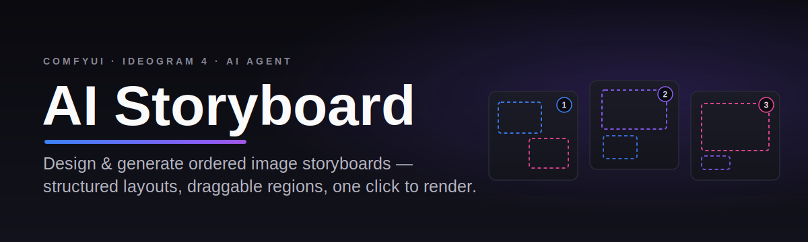

<p align="center">
  
</p>

<p align="center">
  
  
  
</p>

An agentic desktop app for building image **storyboards** — ordered sequences of
images generated with ComfyUI text-to-image models, with first-class support for
**Ideogram 4's structured JSON prompt format**.

A sibling of `ai-video-editor`; it reuses the same stack (Bun + Hono server,
React 19 + Vite client, Drizzle + SQLite, Zustand, Tailwind 4, Electron) and the
same LLM-agent loop, ComfyUI integration, and styleguide subsystem — but is
built around images-in-a-sequence instead of a video timeline.

## What it does

- **Create a project** by choosing an image size the Ideogram way: pick an
  aspect ratio (1:1, 16:9, 9:16, …) and a megapixel target (1MP / 2MP), which
  compute the concrete width/height for every frame.
- **Build the board** one frame at a time with the agent chat, or have the agent
  plan a whole storyboard (it proposes a plan and asks before generating).
- **Refine each image** in an editor where the Ideogram layout's bounding boxes
  render as draggable/resizable overlays on the picture. Edit a region's
  description / text / palette, tweak the high-level + style descriptions and the
  color palette, or edit the raw layout JSON directly (CodeMirror, two-way synced)
  — then generate / regenerate through ComfyUI.
- **Focus the agent** on the whole project or on a single frame (a separate,
  scoped side-conversation per image).
- **View** the sequence as a responsive grid (adjustable columns, drag-to-reorder)
  or in a fullscreen **Display** mode you can page through.
- **Export** to a numbered ZIP of the images or a PDF laid out in 1–6 columns.

## Ideogram layout

Each frame stores a structured layout that is serialized verbatim as the
ComfyUI prompt for Ideogram workflows:

```jsonc
{
  "high_level_description": "…overall scene…",
  "style_description": "…aesthetic, lighting, medium, palette…",
  "color_palette": ["#aabbcc"],
  "compositional_deconstruction": [
    { "bounding_box": [y_min, x_min, y_max, x_max], "description": "…", "text": "literal text" }
  ]
}
```

Bounding boxes are `[y_min, x_min, y_max, x_max]` on a **0–1000 grid, top-left
origin** (Y first). Non-Ideogram t2i workflows fall back to a plain-text prompt
per image.

---

# Setup

You need three things: this app, an **LLM endpoint** (for the agent), and a
**ComfyUI** instance with an Ideogram 4 text-to-image workflow (for the images).

## 1. Install & run

Requires [Bun](https://bun.sh/).

```bash
git clone https://github.com/tjameswilliams/ai-storyboard.git
cd ai-storyboard
bun install
bun run db:push        # create the local SQLite schema
bun run dev            # server :3084 + web client :5176
```

Open <http://localhost:5176>. For the packaged desktop app instead:

```bash
bun run dev:electron   # build + launch the Electron app
```

> First Electron launch only: native SQLite is compiled for Node, so run
> `bunx electron-rebuild -f -w better-sqlite3` once (and again after any
> `bun install` that rebuilds it). The `bun run dev` web flow doesn't need this.

Then click the **gear icon** to open Settings and configure the two integrations
below.

## 2. Configure the LLM  (Settings → LLM)

The agent works with any **OpenAI-compatible** chat endpoint. Fill in the four
fields and Save. To attach reference images in chat you need a **vision-capable**
model; the structured-layout workflow itself does not require vision.

### Option A — DeepSeek (hosted, cheap, great at structured JSON)

| Field | Value |
|---|---|
| API Base URL | `https://api.deepseek.com/v1` |
| API Key | your key from <https://platform.deepseek.com/api_keys> |
| Model | `deepseek-chat` (fast) or `deepseek-reasoner` (more deliberate) |
| Temperature | `0.7` |
| Context Window | `64000` |

DeepSeek is text-only — it's excellent for authoring/refining the Ideogram JSON,
but it can't *see* images you attach in chat. Use Option B with a vision model if
you want the agent to look at reference images.

### Option B — LM Studio (fully local)

1. Install [LM Studio](https://lmstudio.ai/), download a model (for image
   understanding pick a vision model such as **Qwen2.5-VL-7B-Instruct**; for
   text-only any strong instruct model works).
2. Go to the **Developer** tab → **Start Server** (default port `1234`).

| Field | Value |
|---|---|
| API Base URL | `http://localhost:1234/v1` |
| API Key | `lm-studio` (any non-empty string) |
| Model | the model identifier shown in LM Studio (or `local-model`) |
| Temperature | `0.7` |
| Context Window | match the model's context (e.g. `32768`) |

> Any other OpenAI-compatible server works the same way — Ollama
> (`http://localhost:11434/v1`), vLLM, OpenRouter, etc.

## 3. Set up the Ideogram 4 workflow in ComfyUI

Ideogram 4 is an open-weight model with day-0 support in ComfyUI.

1. **Install ComfyUI** and **[ComfyUI-Manager](https://github.com/Comfy-Org/ComfyUI-Manager)**,
   and update ComfyUI to the latest version.
2. **Download the Ideogram 4 model files** and place them in ComfyUI's model
   folders (filenames must match what the workflow references):

   | File | Folder |
   |---|---|
   | `ideogram4_fp8_scaled.safetensors` | `models/diffusion_models/ideogram/` |
   | `ideogram4_unconditional_fp8_scaled.safetensors` | `models/diffusion_models/ideogram/` |
   | `qwen_3_8b_fp8mixed.safetensors` (text encoder) | `models/text_encoders/` |
   | `flux2-vae.safetensors` | `models/vae/FLUX2/` |

   See ComfyUI's Ideogram 4 docs for the exact download links.
3. **Load the graph**: open the ComfyUI canvas and load
   [`workflows/ideogram-v4-t2i.comfyui-graph.json`](workflows/ideogram-v4-t2i.comfyui-graph.json)
   (drag the file onto the canvas, or **Load**).
4. **Install missing nodes**: ComfyUI-Manager → **Install Missing Custom Nodes**
   (the graph uses helper nodes like `ResolutionSelector`, `JsonExtractString`,
   and `ComfyMathExpression`), then **restart** ComfyUI.
5. **Test it** once inside ComfyUI to confirm the models and nodes resolve.
6. If the app runs on a different machine, start ComfyUI listening on the network:
   `python main.py --listen` (default port `8188`).

## 4. Register the workflow in AI Storyboard  (Settings → ComfyUI)

1. Set **ComfyUI Server URL** (e.g. `http://localhost:8188`) and click **Test** —
   you should see *Connected!* (a trailing slash is fine; it's normalized).
2. Click **+ Upload JSON** and select
   [`workflows/ideogram-v4-t2i.api.json`](workflows/ideogram-v4-t2i.api.json)
   (the API-format export). The app auto-detects it as a **t2i** workflow and
   finds the prompt node.
3. Click **set default** next to the new workflow.

That's it — the app maps each project's aspect ratio + megapixels onto the
workflow's `ResolutionSelector`, serializes the frame's Ideogram layout into the
prompt, and renders. Generate from the image editor's **Generate** button or by
asking the agent.

<details>
<summary>Prefer to paste the workflow JSON by hand? Expand for the full API graph.</summary>

In Settings → ComfyUI, upload any small `.json`, click **edit** on it, and paste
this into the JSON field (or just upload the file above):

```json
{
  "37": {
    "inputs": {
      "aspect_ratio": "4:3 (Standard)",
      "megapixels": 1
    },
    "class_type": "ResolutionSelector",
    "_meta": {
      "title": "Resolution Selector"
    }
  },
  "158": {
    "inputs": {
      "filename_prefix": "Ideogram_4.0",
      "images": [
        "98:13",
        0
      ]
    },
    "class_type": "SaveImage",
    "_meta": {
      "title": "Save Image"
    }
  },
  "98:9": {
    "inputs": {
      "vae_name": "FLUX2/flux2-vae.safetensors"
    },
    "class_type": "VAELoader",
    "_meta": {
      "title": "Load VAE"
    }
  },
  "98:10": {
    "inputs": {
      "conditioning": [
        "98:24",
        0
      ]
    },
    "class_type": "ConditioningZeroOut",
    "_meta": {
      "title": "ConditioningZeroOut"
    }
  },
  "98:11": {
    "inputs": {
      "width": [
        "98:31",
        1
      ],
      "height": [
        "98:32",
        1
      ],
      "batch_size": 1
    },
    "class_type": "EmptyFlux2LatentImage",
    "_meta": {
      "title": "Empty Flux 2 Latent"
    }
  },
  "98:12": {
    "inputs": {
      "noise": [
        "98:18",
        0
      ],
      "guider": [
        "98:155",
        0
      ],
      "sampler": [
        "98:16",
        0
      ],
      "sigmas": [
        "98:17",
        0
      ],
      "latent_image": [
        "98:11",
        0
      ]
    },
    "class_type": "SamplerCustomAdvanced",
    "_meta": {
      "title": "SamplerCustomAdvanced"
    }
  },
  "98:13": {
    "inputs": {
      "samples": [
        "98:12",
        0
      ],
      "vae": [
        "98:9",
        0
      ]
    },
    "class_type": "VAEDecode",
    "_meta": {
      "title": "VAE Decode"
    }
  },
  "98:16": {
    "inputs": {
      "sampler_name": "euler"
    },
    "class_type": "KSamplerSelect",
    "_meta": {
      "title": "KSamplerSelect"
    }
  },
  "98:17": {
    "inputs": {
      "steps": [
        "98:151",
        1
      ],
      "width": [
        "98:31",
        1
      ],
      "height": [
        "98:32",
        1
      ],
      "mu": [
        "98:144",
        0
      ],
      "std": [
        "98:146",
        0
      ]
    },
    "class_type": "Ideogram4Scheduler",
    "_meta": {
      "title": "Ideogram 4 Scheduler"
    }
  },
  "98:18": {
    "inputs": {
      "noise_seed": 768206092425535
    },
    "class_type": "RandomNoise",
    "_meta": {
      "title": "RandomNoise"
    }
  },
  "98:14": {
    "inputs": {
      "clip_name": "qwen_3_8b_fp8mixed.safetensors",
      "type": "ideogram4",
      "device": "default"
    },
    "class_type": "CLIPLoader",
    "_meta": {
      "title": "Load CLIP"
    }
  },
  "98:27": {
    "inputs": {
      "value": [
        "37",
        0
      ]
    },
    "class_type": "PrimitiveInt",
    "_meta": {
      "title": "Int (Width)"
    }
  },
  "98:28": {
    "inputs": {
      "value": [
        "37",
        1
      ]
    },
    "class_type": "PrimitiveInt",
    "_meta": {
      "title": "Int (Height)"
    }
  },
  "98:31": {
    "inputs": {
      "expression": "max(((a + 15) // 16) * 16, 256)",
      "values.a": [
        "98:27",
        0
      ]
    },
    "class_type": "ComfyMathExpression",
    "_meta": {
      "title": "Math Expression"
    }
  },
  "98:32": {
    "inputs": {
      "expression": "max(((a + 15) // 16) * 16, 256)",
      "values.a": [
        "98:28",
        0
      ]
    },
    "class_type": "ComfyMathExpression",
    "_meta": {
      "title": "Math Expression"
    }
  },
  "98:144": {
    "inputs": {
      "value": [
        "98:145",
        0
      ]
    },
    "class_type": "ComfyNumberConvert",
    "_meta": {
      "title": "Convert Number"
    }
  },
  "98:145": {
    "inputs": {
      "json_string": [
        "98:148",
        0
      ],
      "key": "mu"
    },
    "class_type": "JsonExtractString",
    "_meta": {
      "title": "Extract Text from JSON"
    }
  },
  "98:146": {
    "inputs": {
      "value": [
        "98:150",
        0
      ]
    },
    "class_type": "ComfyNumberConvert",
    "_meta": {
      "title": "Convert Number"
    }
  },
  "98:147": {
    "inputs": {
      "json_string": "{\n  \"Quality\": {\n    \"num_steps\": 48,\n    \"mu\": 0.0,\n    \"std\": 1.5,\n    \"preset_id\": \"V4_QUALITY_48\"\n  },\n  \"Default\": {\n    \"num_steps\": 20,\n    \"mu\": 0.0,\n    \"std\": 1.75,\n    \"preset_id\": \"V4_DEFAULT_20\"\n  },\n  \"Turbo\": {\n    \"num_steps\": 12,\n    \"mu\": 0.5,\n    \"std\": 1.75,\n    \"preset_id\": \"V4_TURBO_12\"\n  }\n}",
      "key": [
        "98:156",
        0
      ]
    },
    "class_type": "JsonExtractString",
    "_meta": {
      "title": "Extract Text from JSON"
    }
  },
  "98:148": {
    "inputs": {
      "string": [
        "98:147",
        0
      ],
      "find": "'",
      "replace": "\""
    },
    "class_type": "StringReplace",
    "_meta": {
      "title": "Replace Text"
    }
  },
  "98:149": {
    "inputs": {
      "json_string": [
        "98:148",
        0
      ],
      "key": "num_steps"
    },
    "class_type": "JsonExtractString",
    "_meta": {
      "title": "Extract Text from JSON"
    }
  },
  "98:150": {
    "inputs": {
      "json_string": [
        "98:148",
        0
      ],
      "key": "std"
    },
    "class_type": "JsonExtractString",
    "_meta": {
      "title": "Extract Text from JSON"
    }
  },
  "98:151": {
    "inputs": {
      "value": [
        "98:149",
        0
      ]
    },
    "class_type": "ComfyNumberConvert",
    "_meta": {
      "title": "Convert Number"
    }
  },
  "98:155": {
    "inputs": {
      "cfg": 7,
      "model": [
        "98:157",
        0
      ],
      "positive": [
        "98:24",
        0
      ],
      "model_negative": [
        "98:154",
        0
      ],
      "negative": [
        "98:10",
        0
      ]
    },
    "class_type": "DualModelGuider",
    "_meta": {
      "title": "Dual Model CFG Guider"
    }
  },
  "98:156": {
    "inputs": {
      "choice": "Default",
      "index": 1,
      "option1": "Quality",
      "option2": "Default",
      "option3": "Turbo",
      "option4": ""
    },
    "class_type": "CustomCombo",
    "_meta": {
      "title": "Custom Combo"
    }
  },
  "98:157": {
    "inputs": {
      "cfg": 3,
      "start_percent": 0.7,
      "end_percent": 1,
      "model": [
        "98:23",
        0
      ]
    },
    "class_type": "CFGOverride",
    "_meta": {
      "title": "CFG Override"
    }
  },
  "98:23": {
    "inputs": {
      "unet_name": "ideogram/ideogram4_fp8_scaled.safetensors",
      "weight_dtype": "default"
    },
    "class_type": "UNETLoader",
    "_meta": {
      "title": "Load Diffusion Model"
    }
  },
  "98:154": {
    "inputs": {
      "unet_name": "ideogram/ideogram4_unconditional_fp8_scaled.safetensors",
      "weight_dtype": "default"
    },
    "class_type": "UNETLoader",
    "_meta": {
      "title": "Load Diffusion Model"
    }
  },
  "98:24": {
    "inputs": {
      "text": "{\n  \"scene_summary\": \"A premium typography poster for a specialty coffee brand with dense readable text.\",\n  \"style_description\": \"Vibrant and moody, featuring sharp lighting and a warm color palette. Cinematic photography style on textured matte paper.\",\n  \"colour_palette\": [\n    \"#4A2C11\",\n    \"#C87D55\",\n    \"#F4E3C1\",\n    \"#1E1B18\"\n  ],\n  \"composition_deconstruction\": [\n    {\n      \"description\": \"Main coffee cup with steaming foam, centrally focused.\",\n      \"bbox\": [250, 150, 750, 850]\n    },\n    {\n      \"description\": \"Bold elegant typography that reads 'ARTISAN ROASTERS'.\",\n      \"bbox\": [100, 200, 300, 800]\n    }\n  ]\n}",
      "clip": [
        "98:14",
        0
      ]
    },
    "class_type": "CLIPTextEncode",
    "_meta": {
      "title": "CLIP Text Encode (Positive Prompt)"
    }
  }
}
```

</details>

---

## Scripts

- `bun run dev` — server + Vite client
- `bun run db:push` / `bun run db:studio` — Drizzle schema sync / inspector
- `bun run dev:electron` — build + launch the Electron desktop app
- `bun run package` — build a distributable Electron app

## Tech

- **Runtime:** [Bun](https://bun.sh/) (dev) / Node.js (Electron)
- **Backend:** [Hono](https://hono.dev/), SQLite via [Drizzle ORM](https://orm.drizzle.team/)
- **Frontend:** React 19, [Zustand](https://zustand-demo.pmnd.rs/), [Tailwind CSS 4](https://tailwindcss.com/), [CodeMirror](https://codemirror.net/)
- **AI:** any OpenAI-compatible API, [Model Context Protocol](https://modelcontextprotocol.io/)
- **Generation:** [ComfyUI](https://github.com/comfyanonymous/ComfyUI) + [Ideogram 4](https://ideogram.ai/)
- **Desktop:** [Electron](https://www.electronjs.org/)

## License

[MIT](LICENSE) — use it at work, fork it, sell what you build with it.
